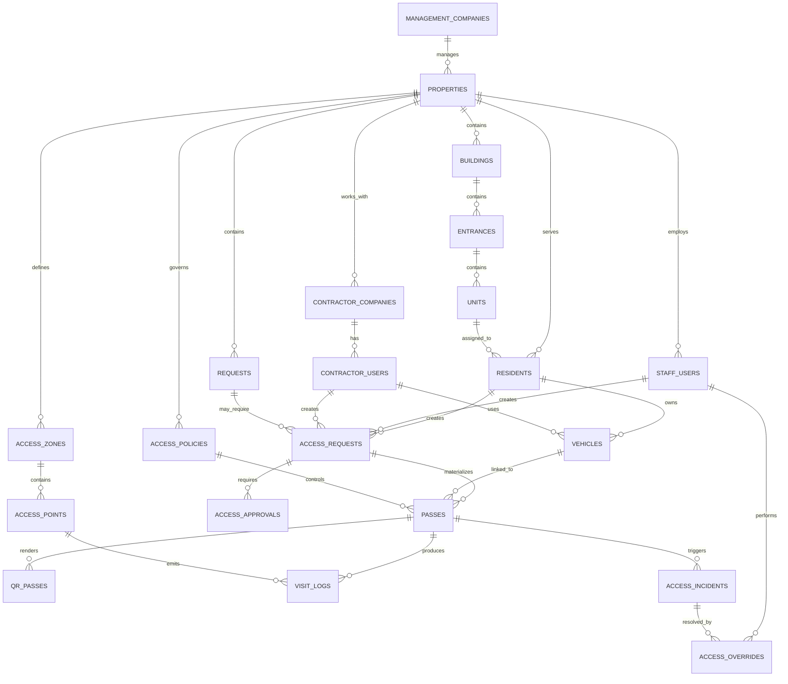

# DomHub — ERD / Data Model Spec для access-platform

Дата: 2026-04-21  
Статус: рабочая data model specification  
Назначение: единый source of truth для модели данных DomHub как платформы управления доступом.

---

## 1. Цель документа

Документ фиксирует:
- какие сущности обязательны для DomHub access-platform;
- какие данные хранятся в `platform DB`, а какие — в `property DB`;
- какие связи между сущностями существуют;
- какие ограничения, индексы и ownership правила обязательны;
- какие enum/state значения должны быть зафиксированы.

Этот документ должен использоваться как опора для:
- database design;
- backend contracts;
- role/scope enforcement;
- analytics model;
- integrations and audit.

---

## 2. Базовый принцип хранения

### Platform DB

Хранит:
- registry объектов;
- управление управляющими компаниями;
- platform-level administrators;
- tenant routing metadata;
- platform-wide audit and health metadata.

### Property DB

Хранит:
- resident/staff/contractor operational data;
- passes, access events, requests, incidents;
- content and notifications;
- object-specific policies and settings;
- analytics source events по объекту.

### Ключевой принцип

`Property DB` — source of truth для operational data объекта.  
`Platform DB` — source of truth для tenant registry и portfolio governance.

---

## 3. ERD overview

---

## 4. Platform DB schema

## 4.1 `management_companies`

Назначение: оператор портфеля объектов.

Поля:
- `id UUID PK`
- `slug VARCHAR(80) UNIQUE NOT NULL`
- `name VARCHAR(255) NOT NULL`
- `legal_name VARCHAR(255)`
- `inn VARCHAR(12)`
- `ogrn VARCHAR(15)`
- `contact_email TEXT`
- `contact_phone TEXT`
- `status VARCHAR(20) NOT NULL DEFAULT 'active'`
- `created_at TIMESTAMPTZ NOT NULL DEFAULT NOW()`
- `updated_at TIMESTAMPTZ NOT NULL DEFAULT NOW()`

Индексы:
- unique index on `slug`
- index on `status`

## 4.2 `properties`

Назначение: объект ЖК / клубный дом / посёлок.

Поля:
- `id UUID PK`
- `management_company_id UUID FK -> management_companies.id NULLABLE`
- `slug VARCHAR(80) UNIQUE NOT NULL`
- `name VARCHAR(255) NOT NULL`
- `property_type VARCHAR(30) NOT NULL`
- `timezone VARCHAR(50) NOT NULL DEFAULT 'Europe/Moscow'`
- `address TEXT`
- `db_connection_url TEXT NOT NULL`
- `status VARCHAR(20) NOT NULL DEFAULT 'active'`
- `plan VARCHAR(30) DEFAULT 'core'`
- `logo_url TEXT`
- `primary_color VARCHAR(20)`
- `feature_flags JSONB NOT NULL DEFAULT '{}'`
- `created_at TIMESTAMPTZ NOT NULL DEFAULT NOW()`
- `updated_at TIMESTAMPTZ NOT NULL DEFAULT NOW()`

Индексы:
- unique index on `slug`
- index on `management_company_id`
- index on `status`

Enum `property_type`:
- `residential_complex`
- `club_house`
- `cottage_community`

Смысл `property_type`:
- `residential_complex` — квартирный ЖК: корпус / подъезд / квартира являются основными labels;
- `club_house` — малый премиальный объект: корпус / секция / лобби / апартамент;
- `cottage_community` — коттеджный посёлок или закрытая территория: сектор / улица / дом / участок / КПП.

`property_type` не меняет tenant isolation и API contracts. Он определяет UI labels, import templates, default access policies and guard workspace emphasis.

Enum `status`:
- `active`
- `suspended`
- `maintenance`
- `terminated`

## 4.3 `platform_admins`

Поля:
- `id UUID PK`
- `email TEXT UNIQUE NOT NULL`
- `password_hash TEXT NOT NULL`
- `name TEXT`
- `is_active BOOLEAN NOT NULL DEFAULT true`
- `last_login_at TIMESTAMPTZ`
- `created_at TIMESTAMPTZ NOT NULL DEFAULT NOW()`

## 4.4 `management_company_admins`

Поля:
- `id UUID PK`
- `management_company_id UUID FK -> management_companies.id`
- `email TEXT NOT NULL`
- `password_hash TEXT NOT NULL`
- `name TEXT`
- `is_active BOOLEAN NOT NULL DEFAULT true`
- `created_at TIMESTAMPTZ NOT NULL DEFAULT NOW()`

Индексы:
- unique index on `(management_company_id, email)`

## 4.5 `platform_audit_log`

Поля:
- `id UUID PK`
- `actor_type VARCHAR(30) NOT NULL`
- `actor_id UUID`
- `action VARCHAR(80) NOT NULL`
- `property_id UUID NULL`
- `management_company_id UUID NULL`
- `details JSONB NOT NULL DEFAULT '{}'`
- `ip_address INET NULL`
- `created_at TIMESTAMPTZ NOT NULL DEFAULT NOW()`

Индексы:
- index on `property_id, created_at DESC`
- index on `management_company_id, created_at DESC`
- index on `action`

---

## 5. Property DB schema

## 5.1 Structure layer

### Product principle

Текущая v1-структура `property -> building -> entrance -> unit` является общей для ЖК, клубных домов и коттеджных посёлков.

`unit` не должен трактоваться только как квартира. В продуктовой модели это addressable dwelling/asset:
- квартира;
- апартамент;
- таунхаус;
- дом;
- участок;
- коммерческое помещение;
- служебная единица.

Для `cottage_community` допускается использовать `building` как "сектор", "улица", "очередь" или "территория", а `entrance` как технический placeholder. UI и import должны скрывать apartment-only terminology and render labels as "дом/участок" and "КПП/сектор" where appropriate.

### `buildings`

Поля:
- `id UUID PK`
- `property_id UUID NOT NULL`
- `code VARCHAR(50)`
- `name VARCHAR(100) NOT NULL`
- `sort_order INTEGER DEFAULT 0`
- `created_at TIMESTAMPTZ NOT NULL DEFAULT NOW()`

Индексы:
- unique index on `(property_id, code)` where code is not null

### `entrances`

Поля:
- `id UUID PK`
- `building_id UUID NOT NULL`
- `code VARCHAR(50)`
- `name VARCHAR(100) NOT NULL`
- `sort_order INTEGER DEFAULT 0`

Индексы:
- unique index on `(building_id, code)` where code is not null

### `units`

Поля:
- `id UUID PK`
- `entrance_id UUID NOT NULL`
- `building_id UUID NOT NULL`
- `property_id UUID NOT NULL`
- `unit_number VARCHAR(30) NOT NULL`
- `unit_type VARCHAR(20) NOT NULL DEFAULT 'apartment'`
- `floor INTEGER NULL`
- `is_active BOOLEAN NOT NULL DEFAULT true`
- `created_at TIMESTAMPTZ NOT NULL DEFAULT NOW()`

Индексы:
- unique index on `(property_id, building_id, entrance_id, unit_number)`
- index on `property_id`

Enum `unit_type`:
- `apartment`
- `townhouse`
- `house`
- `commercial`
- `utility`

Property-type mapping:
- `residential_complex`: default `unit_type='apartment'`;
- `club_house`: `apartment` or `commercial`, depending on object model;
- `cottage_community`: primary `unit_type='house'` or `townhouse`; `unit_number` stores the displayed house/plot number.

Future extension rule:
- do not add separate `streets`, `land_plots`, or `houses` tables until a pilot proves that the v1 mapping creates operational or reporting errors;
- if needed, add `property_areas` / `land_plots` as additive v2 entities without changing existing `unit_id` references.

## 5.2 People layer

### `residents`

Поля:
- `id UUID PK`
- `external_uid TEXT UNIQUE NULL`
- `property_id UUID NOT NULL`
- `unit_id UUID NOT NULL`
- `full_name TEXT NOT NULL`
- `phone TEXT NOT NULL`
- `email TEXT NULL`
- `role VARCHAR(20) NOT NULL DEFAULT 'resident'`
- `resident_type VARCHAR(20) NOT NULL DEFAULT 'owner'`
- `is_active BOOLEAN NOT NULL DEFAULT true`
- `consent_given_at TIMESTAMPTZ NULL`
- `consent_version VARCHAR(20) NULL`
- `created_at TIMESTAMPTZ NOT NULL DEFAULT NOW()`
- `updated_at TIMESTAMPTZ NOT NULL DEFAULT NOW()`

Индексы:
- index on `property_id, unit_id`
- index on `phone`
- index on `is_active`

Enum `resident_type`:
- `owner`
- `tenant`
- `family_member`

### `staff_users`

Поля:
- `id UUID PK`
- `property_id UUID NOT NULL`
- `full_name TEXT NOT NULL`
- `phone TEXT NULL`
- `email TEXT NOT NULL`
- `role VARCHAR(30) NOT NULL`
- `specialization VARCHAR(30) NULL`
- `is_active BOOLEAN NOT NULL DEFAULT true`
- `can_view_resident_phone BOOLEAN NOT NULL DEFAULT false`
- `can_assign_requests BOOLEAN NOT NULL DEFAULT false`
- `created_at TIMESTAMPTZ NOT NULL DEFAULT NOW()`

Индексы:
- unique index on `(property_id, email)`
- index on `role`

Enum `role`:
- `security`
- `concierge`
- `technician`
- `property_admin`

### `contractor_companies`

Поля:
- `id UUID PK`
- `property_id UUID NOT NULL`
- `name TEXT NOT NULL`
- `contact_name TEXT NULL`
- `contact_phone TEXT NULL`
- `contact_email TEXT NULL`
- `status VARCHAR(20) NOT NULL DEFAULT 'active'`
- `created_at TIMESTAMPTZ NOT NULL DEFAULT NOW()`

### `contractor_users`

Поля:
- `id UUID PK`
- `contractor_company_id UUID NOT NULL`
- `property_id UUID NOT NULL`
- `full_name TEXT NOT NULL`
- `phone TEXT NULL`
- `email TEXT NULL`
- `specialization VARCHAR(30) NULL`
- `is_active BOOLEAN NOT NULL DEFAULT true`
- `access_expires_at TIMESTAMPTZ NULL`
- `created_at TIMESTAMPTZ NOT NULL DEFAULT NOW()`

Индексы:
- index on `contractor_company_id`
- index on `property_id, is_active`

## 5.3 Vehicle layer

### `vehicles`

Поля:
- `id UUID PK`
- `property_id UUID NOT NULL`
- `owner_type VARCHAR(20) NOT NULL`
- `owner_resident_id UUID NULL`
- `owner_staff_id UUID NULL`
- `owner_contractor_user_id UUID NULL`
- `plate_number VARCHAR(20) NOT NULL`
- `vehicle_type VARCHAR(20) NOT NULL DEFAULT 'car'`
- `color VARCHAR(40) NULL`
- `brand VARCHAR(60) NULL`
- `model VARCHAR(60) NULL`
- `is_whitelisted BOOLEAN NOT NULL DEFAULT false`
- `is_blacklisted BOOLEAN NOT NULL DEFAULT false`
- `notes TEXT NULL`
- `created_at TIMESTAMPTZ NOT NULL DEFAULT NOW()`

Индексы:
- unique index on `(property_id, plate_number)`
- index on `is_blacklisted`
- index on `owner_resident_id`

Enum `owner_type`:
- `resident`
- `staff`
- `contractor`
- `guest`

Enum `vehicle_type`:
- `car`
- `motorcycle`
- `truck`
- `service_vehicle`

## 5.4 Access topology

### `access_zones`

Поля:
- `id UUID PK`
- `property_id UUID NOT NULL`
- `building_id UUID NULL`
- `name VARCHAR(100) NOT NULL`
- `zone_type VARCHAR(30) NOT NULL`
- `is_active BOOLEAN NOT NULL DEFAULT true`
- `sort_order INTEGER DEFAULT 0`
- `created_at TIMESTAMPTZ NOT NULL DEFAULT NOW()`

Enum `zone_type`:
- `perimeter`
- `residential_entry`
- `parking`
- `public_area`
- `technical_area`
- `service_area`

### `access_points`

Поля:
- `id UUID PK`
- `property_id UUID NOT NULL`
- `zone_id UUID NOT NULL`
- `name VARCHAR(100) NOT NULL`
- `point_type VARCHAR(30) NOT NULL`
- `provider VARCHAR(50) NULL`
- `provider_external_id TEXT NULL`
- `is_active BOOLEAN NOT NULL DEFAULT true`
- `metadata JSONB NOT NULL DEFAULT '{}'`
- `created_at TIMESTAMPTZ NOT NULL DEFAULT NOW()`

Индексы:
- index on `zone_id`
- index on `provider, provider_external_id`

Enum `point_type`:
- `gate`
- `barrier`
- `door`
- `turnstile`
- `wicket`
- `intercom`

### `access_policies`

Поля:
- `id UUID PK`
- `property_id UUID NOT NULL`
- `name VARCHAR(100) NOT NULL`
- `subject_type VARCHAR(20) NOT NULL`
- `subject_role VARCHAR(30) NULL`
- `zone_id UUID NULL`
- `point_id UUID NULL`
- `access_method VARCHAR(30) NOT NULL`
- `approval_mode VARCHAR(20) NOT NULL DEFAULT 'required'`
- `effect VARCHAR(30) NOT NULL DEFAULT 'allow'`
- `priority INTEGER NOT NULL DEFAULT 100`
- `schedule_json JSONB NULL`
- `duration_minutes INTEGER NULL`
- `is_recurring BOOLEAN NOT NULL DEFAULT false`
- `is_active BOOLEAN NOT NULL DEFAULT true`
- `created_by UUID NULL`
- `created_at TIMESTAMPTZ NOT NULL DEFAULT NOW()`

Индексы:
- index on `property_id, is_active`
- index on `zone_id`
- index on `point_id`

Enum `subject_type`:
- `resident`
- `guest`
- `staff`
- `contractor`
- `vehicle`
- `courier`

Enum `access_method`:
- `qr`
- `manual`
- `plate`
- `ble`
- `card`
- `face`
- `pin`

Enum `approval_mode`:
- `auto`
- `required`
- `security_only`
- `admin_only`

Enum `effect`:
- `allow`
- `deny`
- `needs_approval`
- `needs_security_review`
- `incident_required`

## 5.5 Access lifecycle

### `access_requests`

Поля:
- `id UUID PK`
- `property_id UUID NOT NULL`
- `created_by_type VARCHAR(20) NOT NULL`
- `created_by_resident_id UUID NULL`
- `created_by_staff_id UUID NULL`
- `created_by_contractor_user_id UUID NULL`
- `request_type VARCHAR(30) NOT NULL`
- `visitor_name TEXT NULL`
- `visitor_phone TEXT NULL`
- `vehicle_id UUID NULL`
- `target_zone_id UUID NULL`
- `target_point_id UUID NULL`
- `target_unit_id UUID NULL`
- `reason TEXT NULL`
- `starts_at TIMESTAMPTZ NOT NULL`
- `ends_at TIMESTAMPTZ NOT NULL`
- `status VARCHAR(20) NOT NULL DEFAULT 'new'`
- `approval_required BOOLEAN NOT NULL DEFAULT true`
- `approved_at TIMESTAMPTZ NULL`
- `rejected_at TIMESTAMPTZ NULL`
- `cancelled_at TIMESTAMPTZ NULL`
- `created_at TIMESTAMPTZ NOT NULL DEFAULT NOW()`

Индексы:
- index on `property_id, status`
- index on `created_by_resident_id`
- index on `target_zone_id`
- index on `starts_at, ends_at`

Enum `request_type`:
- `guest_access`
- `vehicle_access`
- `contractor_access`
- `courier_access`
- `service_access`
- `temporary_resident_access`

Enum `status`:
- `new`
- `pending_approval`
- `approved`
- `rejected`
- `cancelled`
- `expired`

### `access_approvals`

Поля:
- `id UUID PK`
- `access_request_id UUID NOT NULL`
- `approver_type VARCHAR(20) NOT NULL`
- `approver_staff_id UUID NULL`
- `approver_resident_id UUID NULL`
- `decision VARCHAR(20) NOT NULL`
- `comment TEXT NULL`
- `created_at TIMESTAMPTZ NOT NULL DEFAULT NOW()`

Enum `decision`:
- `approved`
- `rejected`
- `escalated`

### `passes`

Поля:
- `id UUID PK`
- `property_id UUID NOT NULL`
- `access_request_id UUID NULL`
- `pass_type VARCHAR(30) NOT NULL`
- `subject_type VARCHAR(20) NOT NULL`
- `subject_resident_id UUID NULL`
- `subject_staff_id UUID NULL`
- `subject_contractor_user_id UUID NULL`
- `subject_vehicle_id UUID NULL`
- `zone_id UUID NULL`
- `point_id UUID NULL`
- `policy_id UUID NULL`
- `valid_from TIMESTAMPTZ NOT NULL`
- `valid_until TIMESTAMPTZ NOT NULL`
- `status VARCHAR(20) NOT NULL DEFAULT 'active'`
- `approved_by_staff_id UUID NULL`
- `revoked_at TIMESTAMPTZ NULL`
- `revoked_by_staff_id UUID NULL`
- `revoked_reason TEXT NULL`
- `created_at TIMESTAMPTZ NOT NULL DEFAULT NOW()`

Индексы:
- index on `property_id, status`
- index on `subject_vehicle_id`
- index on `valid_from, valid_until`
- index on `policy_id`

Enum `pass_type`:
- `guest`
- `vehicle`
- `resident`
- `staff`
- `contractor`
- `courier`
- `service`
- `emergency`

Enum `status`:
- `active`
- `used`
- `expired`
- `revoked`
- `blocked`

### `qr_passes`

Поля:
- `id UUID PK`
- `pass_id UUID NOT NULL UNIQUE`
- `token TEXT NOT NULL UNIQUE`
- `render_version SMALLINT NOT NULL DEFAULT 1`
- `created_at TIMESTAMPTZ NOT NULL DEFAULT NOW()`

Индексы:
- unique index on `token`

## 5.6 Access execution / events

### `visit_logs`

Поля:
- `id UUID PK`
- `property_id UUID NOT NULL`
- `pass_id UUID NULL`
- `access_point_id UUID NULL`
- `event_type VARCHAR(20) NOT NULL`
- `event_source VARCHAR(20) NOT NULL`
- `person_label TEXT NULL`
- `vehicle_plate TEXT NULL`
- `performed_by_staff_id UUID NULL`
- `provider_event_id TEXT NULL`
- `provider_payload JSONB NULL`
- `occurred_at TIMESTAMPTZ NOT NULL`
- `created_at TIMESTAMPTZ NOT NULL DEFAULT NOW()`

Индексы:
- index on `property_id, occurred_at DESC`
- index on `pass_id`
- index on `access_point_id`
- index on `vehicle_plate`
- index on `provider_event_id`

Enum `event_type`:
- `entry_allowed`
- `entry_denied`
- `exit_allowed`
- `exit_denied`
- `manual_admit`
- `manual_deny`
- `override`

Enum `event_source`:
- `domhub`
- `skud`
- `guard_console`
- `import`

### `access_incidents`

Поля:
- `id UUID PK`
- `property_id UUID NOT NULL`
- `related_pass_id UUID NULL`
- `related_visit_log_id UUID NULL`
- `related_vehicle_id UUID NULL`
- `incident_type VARCHAR(30) NOT NULL`
- `severity VARCHAR(20) NOT NULL DEFAULT 'medium'`
- `status VARCHAR(20) NOT NULL DEFAULT 'open'`
- `title TEXT NOT NULL`
- `description TEXT NULL`
- `created_by_staff_id UUID NULL`
- `assigned_to_staff_id UUID NULL`
- `resolved_at TIMESTAMPTZ NULL`
- `created_at TIMESTAMPTZ NOT NULL DEFAULT NOW()`

Индексы:
- index on `property_id, status`
- index on `incident_type`
- index on `assigned_to_staff_id`

Enum `incident_type`:
- `expired_pass_attempt`
- `invalid_qr`
- `blacklist_hit`
- `outside_time_window`
- `unauthorized_vehicle`
- `manual_override`
- `provider_conflict`
- `suspicious_repeat_attempt`

Enum `status`:
- `open`
- `investigating`
- `resolved`
- `dismissed`

### `access_overrides`

Поля:
- `id UUID PK`
- `property_id UUID NOT NULL`
- `incident_id UUID NULL`
- `pass_id UUID NULL`
- `performed_by_staff_id UUID NOT NULL`
- `override_type VARCHAR(20) NOT NULL`
- `reason TEXT NOT NULL`
- `created_at TIMESTAMPTZ NOT NULL DEFAULT NOW()`

Enum `override_type`:
- `manual_admit`
- `manual_deny`
- `temporary_whitelist`
- `temporary_block`

## 5.7 Access-linked service operations

### `requests`

Минимально обязательные поля для связи с access-layer:
- `id UUID PK`
- `property_id UUID NOT NULL`
- `created_by_resident_id UUID NULL`
- `assigned_to_staff_id UUID NULL`
- `assigned_contractor_user_id UUID NULL`
- `type VARCHAR(30) NOT NULL`
- `status VARCHAR(20) NOT NULL`
- `unit_id UUID NULL`
- `requires_access BOOLEAN NOT NULL DEFAULT false`
- `created_at TIMESTAMPTZ NOT NULL DEFAULT NOW()`

### `request_access_links`

Назначение: привязать access scenario к сервисной заявке.

Поля:
- `id UUID PK`
- `request_id UUID NOT NULL`
- `access_request_id UUID NOT NULL`
- `created_at TIMESTAMPTZ NOT NULL DEFAULT NOW()`

Unique:
- unique index on `(request_id, access_request_id)`

## 5.8 Content / communication

### `announcements`

Поля:
- `id UUID PK`
- `property_id UUID NOT NULL`
- `title TEXT NOT NULL`
- `body TEXT NOT NULL`
- `is_urgent BOOLEAN NOT NULL DEFAULT false`
- `starts_at TIMESTAMPTZ NULL`
- `expires_at TIMESTAMPTZ NULL`
- `created_by_staff_id UUID NULL`
- `created_at TIMESTAMPTZ NOT NULL DEFAULT NOW()`

### `documents`

Поля:
- `id UUID PK`
- `property_id UUID NOT NULL`
- `title TEXT NOT NULL`
- `category VARCHAR(30) NOT NULL`
- `file_url TEXT NULL`
- `body_md TEXT NULL`
- `is_public BOOLEAN NOT NULL DEFAULT false`
- `sort_order INTEGER DEFAULT 0`
- `created_at TIMESTAMPTZ NOT NULL DEFAULT NOW()`

## 5.9 Notifications / audit

### `notification_log`

Поля:
- `id UUID PK`
- `property_id UUID NOT NULL`
- `recipient_type VARCHAR(20) NOT NULL`
- `recipient_id UUID NULL`
- `channel VARCHAR(20) NOT NULL`
- `event_type VARCHAR(60) NOT NULL`
- `status VARCHAR(20) NOT NULL DEFAULT 'sent'`
- `payload JSONB NULL`
- `error_message TEXT NULL`
- `created_at TIMESTAMPTZ NOT NULL DEFAULT NOW()`

### `property_audit_log`

Поля:
- `id UUID PK`
- `property_id UUID NOT NULL`
- `actor_type VARCHAR(20) NOT NULL`
- `actor_id UUID NULL`
- `action VARCHAR(80) NOT NULL`
- `entity_type VARCHAR(40) NOT NULL`
- `entity_id UUID NULL`
- `details JSONB NOT NULL DEFAULT '{}'`
- `created_at TIMESTAMPTZ NOT NULL DEFAULT NOW()`

Индексы:
- index on `property_id, created_at DESC`
- index on `entity_type, entity_id`
- index on `action`

## 5.10 Integrations

### `integrations`

Поля:
- `id UUID PK`
- `property_id UUID NOT NULL`
- `provider VARCHAR(50) NOT NULL`
- `integration_type VARCHAR(30) NOT NULL`
- `status VARCHAR(20) NOT NULL DEFAULT 'active'`
- `settings JSONB NOT NULL DEFAULT '{}'`
- `created_at TIMESTAMPTZ NOT NULL DEFAULT NOW()`

### `integration_events`

Поля:
- `id UUID PK`
- `property_id UUID NOT NULL`
- `integration_id UUID NOT NULL`
- `event_type VARCHAR(60) NOT NULL`
- `direction VARCHAR(10) NOT NULL`
- `status VARCHAR(20) NOT NULL DEFAULT 'pending'`
- `payload JSONB NULL`
- `response_payload JSONB NULL`
- `error_message TEXT NULL`
- `attempt_count INTEGER NOT NULL DEFAULT 0`
- `created_at TIMESTAMPTZ NOT NULL DEFAULT NOW()`
- `processed_at TIMESTAMPTZ NULL`

Enum `direction`:
- `inbound`
- `outbound`

---

## 6. Ownership and tenancy rules

### 6.1 Platform DB ownership

Platform DB owns:
- tenant routing;
- management company relationships;
- platform admins;
- platform-wide audit.

### 6.2 Property DB ownership

Property DB owns:
- all resident/staff/contractor operational records;
- all access records;
- all incidents;
- all notifications and object-specific content;
- all object analytics source data.

### 6.3 Cross-property rule

Operational records must never be shared across property DBs.  
Cross-property analytics must aggregate without exposing raw cross-tenant PII by default.

---

## 7. Mandatory indexes and constraints

Обязательные принципы:

- все lookup-поля по `property_id` должны индексироваться;
- все active status queries должны иметь supporting indexes;
- все внешние идентификаторы provider systems должны иметь searchable indexes;
- plate number, QR token and pass status lookups must be fast;
- all time-window checks (`valid_from`, `valid_until`, `starts_at`, `ends_at`) must be indexed where used operationally.

Обязательные ограничения:

- уникальность `property.slug`;
- уникальность номера авто в пределах объекта;
- уникальность QR token;
- уникальность unit number в корректном объектном контексте;
- contractor and resident records cannot cross property boundary;
- pass cannot refer to subject outside property boundary.

---

## 8. Enum / vocabulary rules

Enum-значения нельзя держать только в UI.  
Они должны быть согласованы между:
- DB constraints;
- backend validation;
- API schemas;
- frontend types;
- analytics metric definitions.

Для этого отдельно потребуется:
- `domhub-state-machines-spec.md`
- `domhub-access-api-contract-spec.md`

---

## 9. Что отдельно не решает этот документ

Этот документ не заменяет:
- API contract spec;
- policy grammar spec;
- state machines spec;
- deployment/tenant ops spec;
- analytics definitions.

Но он является базой для всех них.

---

## 10. Следующие документы после этой модели

После утверждения этой data model нужно сделать:

1. `domhub-access-policy-spec.md`
2. `domhub-state-machines-spec.md`
3. `domhub-access-api-contract-spec.md`
4. `domhub-test-strategy-spec.md`
5. `domhub-integration-architecture-spec.md`

---

## 11. Критерий готовности data model

Эту модель можно считать достаточно зрелой, когда:
- backend может строить миграции без доменных догадок;
- frontend понимает все основные сущности и ownership;
- analytics знает source entities;
- permission model знает границы данных;
- integrations layer знает, какие сущности являются source of truth;
- product не добавляет новые core сущности ad hoc в каждом спринте.

